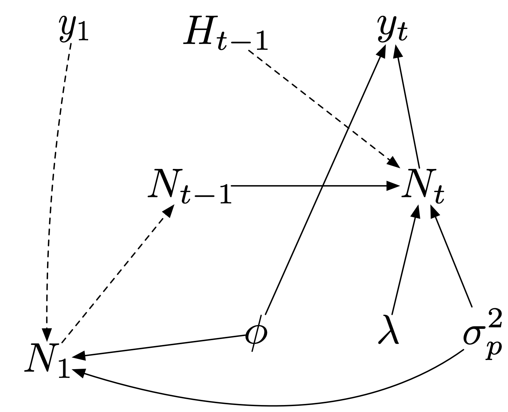

<script src="../../_HeadersEtc/hideOutput.js"></script>


##### `r readChar("../../_HeadersEtc/SESYNCBayes/Title.txt", file.info("../../_HeadersEtc/SESYNCBayes/Title.txt")$size)`

##### Dynamic Models: Forecasting The Effects of Harvest on Lynx

##### `r format(Sys.Date(), format="%B %d, %Y")`

```{r preliminaries, include = FALSE}
library(knitr)
library(SESYNCBayes)
library(rjags)
library(MCMCvis)
library(HDInterval)
set.seed(10)
knitr::opts_chunk$set(cache = TRUE, tidy = FALSE)
```

----

### **Motivation**

The Eurasian lynx (*Lynx lynx*) is a medium-sized predator with broad distribution in the boreal forests of Europe and Siberia. The lynx is classified as a threatened species throughout much of its range and there is controversy about the legal harvest of lynx in Sweden. Proponents of harvest argue that allowing hunting of lynx reduces illegal kill (poaching).  Moreover, Sweden is committed to regulate lynx numbers to prevent excessive predation on reindeer because reindeer are critical to the livelihoods of indigenous pastoralists, the Sami.  Many environmentalists oppose harvest, however, arguing that lynx are too rare to remove their fully protected status. A similar controversy surrounds management of wolves in the Western United States.

<div class = "row">
<div class = "col-md-6" style="margin-top: 5px">

</div>
<div class="col-md-6" style="margin-top: 5px">

</div>
</div>

A forecasting model for the abundance of lynx will help managers make decisions. You have data about the number of lynx family groups censused in the unit as well as annual records of lynx harvested from the unit. You will model the population using the deterministic model: 

$$N_t=\lambda(N_{t-1}-H_{t-1}).$$

where $N_{t}$ is the true, unobserved abundance of lynx and $H_{t-1}$ is the number of lynx harvested during $t-1$ to $t$. The parentheses in this expression reflect the fact that harvest occurs immediately after census, such that the next years population increment comes from the post-harvest population size. 

**ADVANCED (for the population modelers)** What would be the model if harvest occurred immediately before census? Three months after census? Continuously throughout the year?

<button class="button" onclick="toggle_visibility('myDIV1');">Answer</button>

<div id="myDIV1", style="display:none">

<br>

**Immediately before census:**

$$N_t=\lambda N_{t-1}-H_{t-1}.$$
**Three months after census:**

$$N_t=(\lambda^{\frac{1}{4}}N_{t-1}-H_{t-1})\lambda^{\frac{3}{4}}$$
$$N_t=(\lambda^{\frac{1}{4}}N_{t-1}-H_{t-1})\lambda^{\frac{3}{4}}$$
**Throughout the year:**

$$N_t=(\lambda^{\frac{1}{2}}N_{t-1}-H_{t-1})\lambda^{\frac{1}{2}}$$
$$N_t=\lambda N_{t-1}-\lambda^{\frac{1}{2}}H_{t-1}$$

</div>

<br>

Assume the harvest is observed without error ($N_t$), notably our Swedish colleagues are amazing snow trackers and do a good job of estimating the number of family groups (if not the number of lynx) in a management region.  The challenge in this problem is that the observations of lynx abundance (family groups) is not the same as the observation of harvest (number of lynx). Fortunately, you have prior information on the proportional relationship between number of family groups and number of lynx in the population, i.e:

$$\phi=\frac{f}{N},$$ 

where $f$ is the number of family groups and $N$ is the population size, mean $\phi=0.163$ with standard deviation of the mean = 0.012. 

<br>

---

##### **R libraries needed for this lab**

You need to load the following libraries. Set the seed to 10 to compare your answers to ours. The data for this problem is located in the `LynxFamilies` data frame of the `SESYNCBayes` package. 

```{r eval = FALSE, echo = TRUE}
library(SESYNCBayes)
library(rjags)
library(MCMCvis)
library(HDInterval)
set.seed(10)
```

<br>

---

##### **Generating an Informed Prior for $\phi$**

We've provided you with a useful moment matching function below for converting the mean and standard deviation of $\phi$ to the parameters for the beta distribution you will use as an informed prior on $\phi$.

```{r, echo=TRUE, fig.align = 'center'}
# Function to get beta shape parameters from moments
shape_from_stats <- function(mu = mu.global, sigma = sigma.global) {
  a <-(mu^2 - mu^3 - mu * sigma^2) / sigma^2
  b <- (mu - 2 * mu^2 + mu^3 - sigma^2 + mu*sigma^2) / sigma^2
  shape_ps <- c(a, b)
  return(shape_ps)
}

# get parameters for distribution of population multiplier, 1/p
shapes = shape_from_stats(.163, .012)

# check prior on p using simulated data from beta distribution
x = seq(0, 1, .001)
p = dbeta(x, shapes[1], shapes[2])
plot(x, p, typ = "l", xlim = c(0, 1))
```

<br>

---

##### **Diagram the Bayesian network**

1. Develop a hierarchical Bayesian model (also called a state space model) of the lynx population in the management unit. Diagram the Bayesian network (the DAG) of knowns and unknowns and write out the posterior and factored joint distribution. Use a lognormal distribution to model the true lynx population size over time. Use a Poisson distribution for the data model relating the true, unobserved state (the total population size) to the observed data (number of family groups).

<button class="button" onclick="toggle_visibility('myDIV2');">Answer</button>

<div id="myDIV2", style="display:none">

<br> 

<center>

</center>

$$\begin{align*}
[\phi, \lambda, \pmb{N}, \sigma^{2}_{p}] \mid \pmb{y}] &\propto  \prod_{i=2}^{n}[y_{t} \mid N_{t}, \phi][N_{t} \mid \lambda, N_{t-1}, \sigma^{2}_{p}]
[N_{1}\mid \phi, \sigma^{2}_{p}][\phi][\lambda][\sigma^{2}_{p}]\\
y_{t} &\sim \text{Poisson}(N_{t}\phi)\\
N_{t} &\sim \text{lognormal}(\log(\lambda(N_{t-1}-H_{t-1})), \sigma^{2}_{p})\\
\phi &\sim \text{beta}(154, 792)\\
N_{1} &\sim \text{lognormal}\bigg(\log\bigg(\frac{y_{i}}{\phi}\bigg), \sigma^{2}_{p}\bigg)\\
\lambda &\sim \text{uniform}(0.1, 10)\\
\sigma^{2}_{p} &\sim \text{uniform}(0, 5)\\
\end{align*}$$

</div>

<br>

2. **ADVANCED** An alternative approach, which is slightly more difficult to code, is to model the process as: 

$$\text{negative binomia}(N_t|\lambda(N_{t-1}-H_{t-1}, \rho)),$$ 

and model the data as:

$$\text{binomial}(y_t| \text{round}(N_t\phi),p),$$

where $p$ is a detection probability. Explain why this second formulation *might* be better than the formulation you are using. (It turns out they give virtually identical results.) 

<button class="button" onclick="toggle_visibility('myDIV2A');">Answer</button>

<div id="myDIV2A", style="display:none">

<br> 

There are two advantages to using a negative binomial process model and binomial data model. A negative binomial process model treats the true state as an integer, which for small populations, has some advantages because it includes demographic stochasticity.  The binomial data model assures that the observed state is never larger than the true state, which makes sense if the only source of error in the census is failing to observe families that are present.  On the other hand, if there is a possibility of double-counting, which is the case here, the then Poisson is a better choice for the data model.

</div>

<br>

---

##### **Fitting the Model**

Now you'll estimate the marginal posterior distribution of the unobserved, true state over time ($\mathbf{N}$), the parameters in the model $\lambda$ and $\phi$ as well as the process variance and observation variance. You'll also summarize the marginal posterior distributions of the parameters and unobserved states. A note about the data. Each row in the data file gives the observed number of family groups for that year in column 2 and that year's harvest in column 3.  The harvest in each row influences the population size in the next row. So, for example, the 2016 harvest influences the 2017 population size.  

Before you begin it's very helpful to use simulated data to the verify initial values and model. We simulate the true state by choosing some biologically reasonable values for model parameters and "eyeballing" the fit of the true state to the data.  You can then use these simulated values for initial conditions (see the `inits` list below). This is of particular importance because failing to give reasonable initial conditions for dynamic models can cause problems in model fitting. Remember, supply initial conditions for *all* unobserved quantities in the posterior distribution (even those that do not have priors).   

```{r, fig.align = 'center'}
y <- LynxFamilies
endyr <- nrow(y)
n <- numeric(endyr + 1)
mu <- numeric(endyr + 1)
fg <- numeric(endyr + 1)
phi <- 0.16
lambda <- 1.07
sigma.p <- 0.2
 
n[1] <- y$census[1] / phi # n in the unit of individuals
mu[1] <- n[1] # mean from deterministic model to simulate
fg[1] <- n[1] * phi # Nt in the unit of
 
for (t in 2:(endyr + 1)) {
  mu[t] <- lambda * (n[t - 1] - y$harvest[t - 1])
  n[t] <- rlnorm(1, log(mu[t]), sigma.p)
  fg[t] <- n[t] * phi
}

plot(y$year, y$census, ylim = c(0, 100), xlab = "Year", ylab = "Family group", main = "Simulated data")
lines(y$year, fg[1:length(y$year)])
```


```{r, fig.align = 'center'}
## visually match simulated data with observations for initial conditions
endyr = nrow(y)
n = numeric(endyr + 1)
mu = numeric(endyr + 1) #use this for family groups
lambda = 1.1
sigma.p = .00001
n[1] = y$census[1]

for(t in 2:(endyr + 1)) {
  n[t] <- lambda * (y$census[t - 1] - .16 * y$harvest[t - 1])  # use this for family groups
}

plot(y$year, y$census, ylim = c(0, 100), xlab = "Year", ylab = "Family group", main = "Simulated data")
lines(y$year, n[1:length(y$year)])
```

Here's your starting code: 

```{r}
data = list(
	y.endyr = endyr,
	y.a = shapes[1], 
	y.b = shapes[2],
	y.H = y$harvest,
	y = y$census)

inits = list(
	list(lambda = 1.2, sigma.p = .01, N = n),
	list(lambda = 1.01,sigma.p = .2, N = n * 1.2),
	list(lambda = .95, sigma.p = .5, N = n * .5))
```

<br>

1. Write the JAGS model to estimate the marginal posterior distribution of the unobserved, true state over time ($\mathbf{N}$), the parameters in the model $\lambda$ and $\phi$ as well as the process variance and observation variance. Include a summary the marginal posterior distributions of the parameters and unobserved states.

<button class="button" onclick="toggle_visibility('myDIV3');">Answer</button>

<div id="myDIV3", style="display:none">

<br>

```{r}
{
sink("LynxHarvest.R")
cat("

model{

  # priors
  sigma.p ~ dunif(0, 5)
  tau.p <- 1 / sigma.p^2
  lambda ~ dunif(0, 10)
  p ~ dbeta(y.a, y.b)  

  # Get parameters a and b from mean and sd using moment matching to make this prior informative.  
  # These are calcuated on R side and read in as data.

  # Informative priors on initial conditions based on first year's observation of family groups
  fg[1] ~ dpois(y[1])
  N[1] ~ dlnorm(log(y[1] / p),tau.p)

  # process model
  for (t in 2:(y.endyr + 1)) {  # the last year is a forecast with known harvest data
	  mu[t] <- log(max(.0001, lambda * (N[t - 1] - y.H[t - 1])))
	  N[t] ~ dlnorm(mu[t], tau.p)
	  fg[t] <- N[t] * p
	}# end of process model
		
  # data model
  for (t in 2:y.endyr) {   
	  y[t] ~ dpois(p * N[t])  
  }# end of data model

  # Model checking
  for (t in 1:y.endyr) {
    # simulate new data for posterior predicitve check
	  y.rep[t] ~ dpois(p * N[t])
	  # accumlate test statistics for posterior predictive check
	  sq[t] <- (y[t] - p * N[t])^2
	  sq.rep[t] <- (y.rep[t] - p * N[t])^2
    # compute residuals for autocorrelation check
    e[t] <- y[t] - fg[t]
  }

  # calculate Bayesian P value
  fit <- sum(sq[])
  fit.new <- sum(sq.rep[])
  pvalue <- step(fit.new - fit)

} #end of model

",fill=TRUE)
sink()
}
```

```{r, eval=TRUE, echo=TRUE}
n.update = 10000
n.iter = 50000
n.adapt = 5000
n.thin = 1

jm = jags.model("LynxHarvest.R", data = data, inits = inits, n.adapt = n.adapt, n.chains = length(inits))
update(jm, n.iter = n.update)
z = coda.samples(jm, variable.names = c("lambda", "sigma.p", "p", "e", "N", "fg", "pvalue", "fit", "fit.new"), 
  n.iter = n.iter, thin = n.thin)
```

</div>

<br>

2. Check MCMC chains for model parameters, process variance, and latent states for convergence. This will probably require using the `excl` option in `MCMCsummary`.

<button class="button" onclick="toggle_visibility('myDIV4');">Answer</button>

<div id="myDIV4", style="display:none">

<br>

```{r,}
MCMCsummary(z, excl = c("fit.new", "fit", "e"), n.eff = TRUE, digits = 2)
```
</div>

<br>

4. Conduct posterior predictive checks by simulating a new dataset for family groups ($f_t$) at every MCMC iteration. Calculate a Bayesian p value using the sums of squared discrepancy between the observed and the predicted number of family groups based on observed and simulated data,

$$T^{observed}	=	\sum_{t=1}^{n}(f_{t}^{observed}-N_{t}\phi)^{2}
\\T^{model}	=	\sum_{t=1}^{n}(f_{t}^{simulated}-N_{t}\phi)^{2}.$$ 
The Bayesian p value is the proportion of MCMC iterations for which $T^{model}>T^{obs}$.

<button class="button" onclick="toggle_visibility('myDIV5');">Answer</button>

<div id="myDIV5", style="display:none">

<br>

```{r, fig.align = 'center'}
par(mfrow = c(1, 1))
fit.new = MCMCchains(z, "fit.new")
fit = MCMCchains(z, "fit")
plot(fit.new,fit, xlab = "Discrepancy observed", ylab = "Discrepancy simulated", cex = .05, xlim = c(0,3000), 
  ylim = c(0,3000))
abline(0,1)
p = MCMCpstr(z, params = "pvalue", func = mean)
text(500, 2500, paste("Bayesian P value = ", as.character(signif(p$pvalue, 2))))
```
</div>

<br>

Assure yourself that the process model adequately accounts for temporal autocorrelation in the residuals--- allowing the assumption that they are independent and identically distributed. To do this, include a derived quantity

$$e_t=y_t-N_t\phi,$$ 

in your JAGS code and JAGS object. Use the following code or something like it to examine how autocorrelation in the residuals changes with time lag. 
  
5. Write a paragraph describing how to interpret the plot produced by this function.

```{r, eval = FALSE}
acf(unlist(MCMCpstr(z, param = "e", func = mean)), main = "", lwd = 3, ci = 0)
```

<button class="button" onclick="toggle_visibility('myDIV6');">Answer</button>

<div id="myDIV6", style="display:none">

<br>

The autocorrelation of time series is the Pearson correlation between values of the process at two different times, as a function of the lag between the two times.  It can take on values between -1 and 1. Values close to 1 or -1 indicate a high degree of correlation. The residuals not auto correlated if their values drop close to 0 at relatively short lags and alternate between positive and negative values at subsequent lags. This plot reveals no autocorrelation in the residuals of our model.

```{r, eval = TRUE, echo=FALSE, fig.align = 'center'}
acf(unlist(MCMCpstr(z, param="e", func = mean)), main = "", lwd = 3, ci = 0)
```

</div>

<br>

6. Plot the median of the marginal posterior distribution of the number of lynx family groups over time (1998-2016) including a highest posterior density interval. Include your forecast for 2017 (the predictive process distribution) in this plot.

<button class="button" onclick="toggle_visibility('myDIV7');">Answer</button>

<div id="myDIV7", style="display:none">

<br>

```{r,eval = TRUE, fig.align = 'center', fig.cap = "Median population size of lynx (solid line) during 1997-2016 and forecasts for 2017 with 95% credible intervals (dashed lines). Red dotted lines give acceptable range of number of family groups determined in public input process."}
# Plot true, unobserved state and forecast vs observations.
par(mfrow = c(1, 1))
# +1 gives the one year forecast
years = seq(1998, y[nrow(y), 1] + 1)
fg = MCMCpstr(z, params = "fg", func = median)
fgHPDI = MCMCpstr(z, params = "fg", func = function(x) hdi(x, .95))
y2 = c(y$census, NA)
plot(years,y2, ylim = c(0, 100), ylab = "Number of Lynx Family Groups", xlab = "Years")
lines(years, fg$fg)
lines(years, fgHPDI$fg[,2], lty = "dashed")
lines(years, fgHPDI$fg[,1], lty = "dashed")
abline(h=26, lty = "dotted", col = "red")
abline(h=32, lty = "dotted", col = "red")
```

</div>

<br>

7. **ADVANCED** Due to licensing constraints related to the time that it takes to properly issue hunting permits/licenses, Lynx harvest decisions are made before the population is censused, even though harvest actually occurs shortly after the census. Make a forecast of the number of family groups in 2018 assuming five alternative levels for 2017 harvest (0, 10, 25, 50, and 75 animals). Environmentalists and hunters have agreed on a acceptable range for lynx abundance in the unit, 26 - 32 family groups. Compute the probability that the post-harvest number of family groups will be below, within, and above this range during 2018. Tabulate these values. Hint: Set up a "model experiment" in your JAGS code where you forecast the number of lynx family groups during 2018 under the specified levels of harvest. Extract the MCMC chains for the forecasted family groups( e.g., `fg.hat`) using `MCMCchains` Use the `ecdf` function on the R side to compute the probabilities that the forecasted number groups will be below, within, or above the acceptable range.  

<button class="button" onclick="toggle_visibility('myDIV8');">Answer</button>

<div id="myDIV8", style="display:none">

<br>

```{r}
# Levels of  Harvest to evaluate relative to goals for forecasting part.
h = c(0, 10, 25, 50, 75)

data = list(
	y.endyr = endyr,
	y.a = shapes[1], 
	y.b = shapes[2],
	y.H = y$harvest,
	y = y$census,
	h = h)

inits = list(
	list(lambda = 1.2, sigma.p = .01, N = n),
	list(lambda = 1.01,sigma.p = .2, N = n * 1.2),
	list(lambda = .95, sigma.p = .5, N = n * .5))
```


```{r}
{
sink("LynxHarvest.R")
cat("

model{

  # priors
  sigma.p ~ dunif(0, 5)
  tau.p <- 1 / sigma.p^2
  lambda ~ dunif(0, 10)
  p ~ dbeta(y.a, y.b)  

  # Get parameters a and b from mean and sd using moment matching to make this prior informative.  
  # These are calcuated on R side and read in as data.

  # Informative priors on initial conditions based on first year's observation of family groups
  fg[1] ~ dpois(y[1])
  N[1] ~ dlnorm(log(y[1] / p),tau.p)

  # process model
  for (t in 2:(y.endyr + 1)) {  # the last year is a forecast with known harvest data
	  mu[t] <- log(max(.0001, lambda * (N[t - 1] - y.H[t - 1])))
	  N[t] ~ dlnorm(mu[t], tau.p)
	  fg[t] <- N[t] * p
	}# end of process model
		
  # data model
  for (t in 2:y.endyr) {   
	  y[t] ~ dpois(p * N[t])  
  }# end of data model

  # Model checking
  for (t in 1:y.endyr) {
    # simulate new data for posterior predicitve check
	  y.rep[t] ~ dpois(p * N[t])
	  # accumlate test statistics for posterior predictive check
	  sq[t] <- (y[t] - p * N[t])^2
	  sq.rep[t] <- (y.rep[t] - p * N[t])^2
    # compute residuals for autocorrelation check
    e[t] <- y[t] - fg[t]
  }

  # calculate Bayesian P value
  fit <- sum(sq[])
  fit.new <- sum(sq.rep[])
  pvalue <- step(fit.new - fit)

  # Forecast effects of different harvest regeimes on number of family grops during 2018
	for(i in 1:length(h)) {
		mu.hat[i] <- log(max(.001, lambda * (N[y.endyr + 1] - h[i]))) 
		N.hat[i] ~ dlnorm(mu.hat[i], tau.p)	# Nhat forecasts 2 years out
		fg.hat[i] <- N.hat[i] * p
  }
	
} #end of model

",fill=TRUE)
sink()
}
```

```{r, eval=TRUE, echo=TRUE}
n.update = 10000
n.iter = 50000
n.adapt = 5000
n.thin = 1

jm = jags.model("LynxHarvest.R", data = data, inits = inits, n.adapt = n.adapt, n.chains = length(inits))
update(jm, n.iter = n.update)
z2 = coda.samples(jm, variable.names = "fg.hat", n.iter = n.iter, thin = n.thin)
```


```{r,}
# Acceptable limits on poplation size, determined by public input process.
lower = 26
upper = 32
p.in = numeric(length(h))
p.over = numeric(length(h))
p.under = numeric(length(h))

# get chains for harvest experiment
fg.hat = MCMCchains(z2, "fg.hat")

for (j in 1:length(h)) {
	p1 = ecdf(fg.hat[, j])(upper)
	p.under[j] = ecdf(fg.hat[, j])(lower)
	p.in[j] = p1 - p.under[j]
	p.over[j] = 1 - p1
}

# trim to reasonable signficiant digits
p.under = signif(p.under, 2)
p.in = signif(p.in, 2)
p.over = signif(p.over, 2)

alt.table = as.data.frame(cbind(h, p.under, p.in, p.over))
names(alt.table) = c("Harvest", "P(under)", "P(in)", "P(over)")
alt.table
```
</div>

<br>

```{r echo = FALSE}
unlink("LynxHarvest.R", recursive = FALSE, force = FALSE)
```