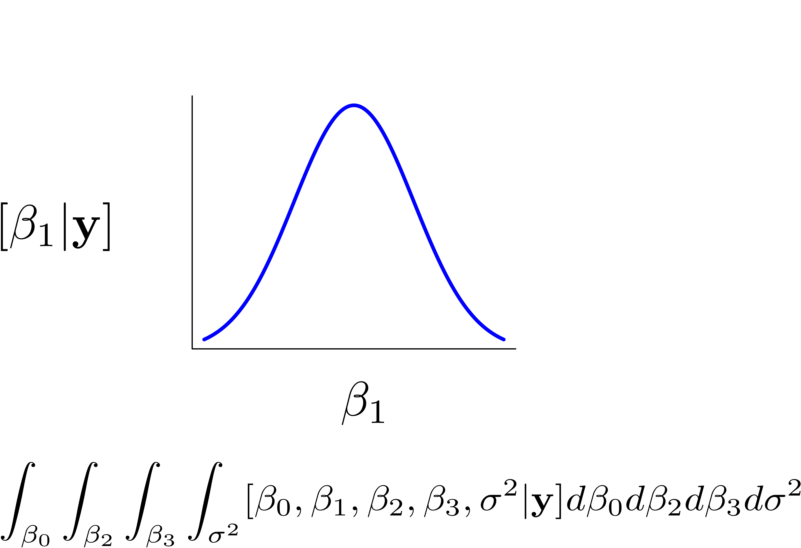
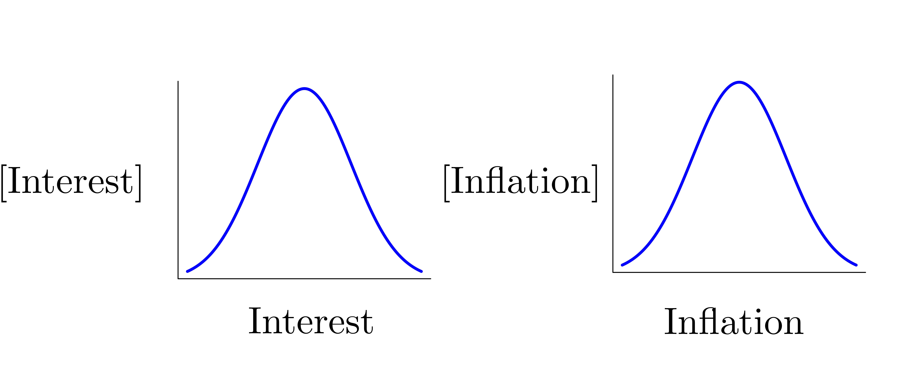

<script src="../../_HeadersEtc/hideOutput.js"></script>


##### `r readChar("../../_HeadersEtc/SESYNCBayes/Title.txt", file.info("../../_HeadersEtc/SESYNCBayes/Title.txt")$size)`

##### Probability Lab 3: Marginal Distributions

##### `r format(Sys.Date(), format="%B %d, %Y")`

```{r preliminaries, include = FALSE}

library(knitr)

knitr::opts_chunk$set(cache = FALSE)

set.seed(10)

```

----

The holy grail in Bayesian analysis is to discover the *marginal posterior distribution* of unobserved quantities (parameters, latent states, missing data, forecasts) from quantities we are able to observe (data). Here is our modus operandi, applicable to virtually all analysis problems.  We always start with the joint distribution of the unobserved quantities and the data.  We then factor the joint distribution into sensible parts.  We use the factored joint distribution as a recipie for finding the marginal distributions of the unobsereved quantities using the Markov chain Monte Carlo algorithm, as we will learn about soon.  It follows that we must understand what marginal distributions are.  

Marginal distributions can be used to describe discrete or continuous random variables, but the continuous case is the one we will see most often in the course, so we emphasize it here. 

1. Sketch the distribution represented by the following integral: 
$$\int_{\beta_0}\int_{\beta_2}\int_{\beta_3}\int_{\sigma^2}[\beta_0,\beta_1,\beta_2,\beta_3,\sigma^2|\mathbf{y}]d\beta_0d\beta_2d\beta_3d\sigma^2$$


<button class="button" onclick="toggle_visibility('myDIV1');">Answer</button>

<div id="myDIV1", style="display:none">

<br>

<div style="width:400px; height=400px; margin:0 auto;">
<center>

</center>
</div>

</div>

<br>

2. The rate of inflation and the rate of return on investments are know to be positively correlated. Assume that the mean rate of inflation is 0.03 with a standard deviation of 0.015.  Assume that the mean rate of return is 0.05 with a standard deviation of 0.07.  Assume the correlation between inflation and rate of return is 0.5.

Representing the correlation between the rates requires a new distribution, the multivariate normal:

$$ \mathbf{z} \sim \text{multivariate normal}({\boldsymbol{\mu}, \boldsymbol{\Sigma}}),$$
where $\mathbf{z}$ is a vector of random variables, $\boldsymbol\mu$ is a vector of means (which can be the output of a deterministic model) and $\boldsymbol\Sigma$ is a variance covariance matrix. The diagonal of $\boldsymbol{\Sigma}$ contains the variances of the $\boldsymbol\mu$ and the off diagonal elements contain the covariances $\text{cov}(\mu_i,\mu_j)$ between $\mu_{i}$ and $\mu_{j}$. The covariance can be calculated as $\text{cov}(\mu_i,\mu_j)=\sigma_i\sigma_j\rho$ where $\sigma_i$ is the standard deviation of the $ith$ random variable, $\sigma_j$ is the standard deviation of the $jth$ random variable, and $\rho$ is the correlation between the random variable $i$ and $j$. The covariance matrix is square and symmetric. We will learn more about these matrices later in the course.  For now, an example will go a long way toward helping you understand the multivariate normal distribution.


You can simulate interest rate and inflation data reflecting their correlation using the following function:

```{r, fig.width = 6, fig.height = 5, fig.align = 'center'}

library(MASS)

DrawRates = function(n, int, int.sd, inf, inf.sd, rho.rates) {

  covar = rho.rates * int.sd * inf.sd
  Sigma <- matrix(c(int.sd^2, covar, covar, inf.sd^2), 2, 2)
  mu = c(int, inf)
  x = (mvrnorm(n = n, mu = mu, Sigma))
  return(x)

  }

x = DrawRates(n = 10000, int = .05, int.sd = .07, inf = .03, inf.sd = .015, rho.rates = .5)

plot(x[,1], x[,2], pch = 19, cex = .05, xlab = "Rate of return", ylab = "Rate of inflation")
```

What would this cloud look like if the rates were not correlated? Show an approximate plot of the marginal distribution of each random variable. It turns out this is the way we will do it with Markov chain Monte Carlo approximations of the marginal posterior distribution, which we will learn about later in the course. 

<button class="button" onclick="toggle_visibility('myDIV2');">Answer</button>

<div id="myDIV2", style="display:none">

<br>

<div style="width:600px; height=400px; margin:0 auto;">
<center>

</center>
</div>

<br>

```{r eval = TRUE, echo = TRUE, fig.width = 8, fig.height = 4, fig.align = 'center'}

par(mfrow= c(1, 2))

hist(x[,1], xlab = "Interest Rate", main = "", freq = FALSE, breaks = 100)

hist(x[,2], xlab = "Inflation Rate", main = "", freq = FALSE, breaks = 100)
```

</div>

<br>

