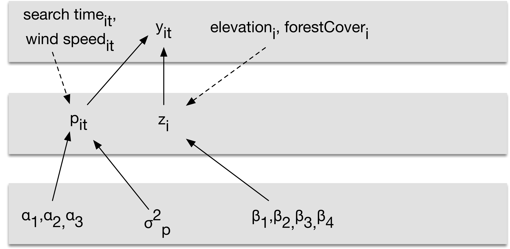

<script src="../../_HeadersEtc/hideOutput.js"></script>


##### `r readChar("../../_HeadersEtc/SESYNCBayes/Title.txt", file.info("../../_HeadersEtc/SESYNCBayes/Title.txt")$size)`

#### Swiss Birds Occupancy Modeling Lab 

##### `r format(Sys.Date(), format="%B %d, %Y")`

```{r preliminaries, include = FALSE}
library(knitr)
library(rjags)
library(MCMCvis)
library(HDInterval)
library(SESYNCBayes)
set.seed(10)
knitr::opts_chunk$set(cache = TRUE)
```

-----

### **Motivation**

Modeling presence or absence is a classic problem involving mixture models, specifically random variables that are zero-inflated. Extra zeros are encountered when we model presence or absence because zeros arise from two conditions: truly absent individuals and individuals present but undetected.  This means we need a model for the process that controls occupancy, the true state, and model of the data that accounts for detection.  This is often our starting point in Bayesian analysis -- there is a true, unobserved state we seek to understand using a model of a process.  We take imperfect observations on that state and must correct them using a model of the data.

<br>

---

##### **R libraries needed for this lab**

You need to load the following libraries. Set the seed to 10 to compare your answers to ours.

```{r eval = FALSE, echo = TRUE}
library(rjags)
library(MCMCvis)
library(HDInterval)
library(SESYNCBayes)
set.seed(10)
```

<br>

---

### **Problem**

A fundamental question in landscape ecology seeks to understand how landscape structure shapes variation in habitat use by species. We will use data from the Swiss Survey of Common Breeding Birds, courtesy of Royle and Dorazio (2008), to model habitat occupancy by a resident bird in the Swiss Alps, the willow tit (*Parus montanus*). The data come from annual surveys of one km^2^ quadrats distributed across Switzerland (Fig. 1). Surveys are conducted during the breeding season on three separate days, but some quadrats have missing data so that the number of replicate observations is fewer than three. 

During each survey, an observer records every visual or acoustic detection of a breeding species (we do not differentiate between these two types of detection in this problem) and marks its location using a global positioning system or, in earlier years, a paper map. We assume that the true state (occupied or unoccupied) does not change among sample dates, an assumption known as closure. This assumption is reasonable because we are observing a resident species during the breeding season. 


<p style="clear: both;">

Fig. 1. The willow tit (left, credit: Francis C. Franklin) is one of 70 bird species that are surveyed annually for abundance in 267 1 km^2^ sampling units distributed across Switzerland (right, credit: the Swiss Ornithological Institute). 

We want to understand the influence of forest cover and elevation on the distribution of the willow tit. The data frame ``SwissBirds`` has the number of times a quadrat (``quadrat``) was searched (``numberVisits``) and the number of times willow tits were detected (``numberDetections``). We have covariates on forest canopy cover (``forestCover``) as well as elevation in meters (``elevation``) for each quadrat surveyed. Data on detection each day on each quadrat (0 or 1) are also available. Develop a model of the influence of forest cover and elevation on the distribution of willow tits. Your model should allow estimation of the optimum elevation of willow tit habitat at the mean forest cover, where optimum elevation is defined as the elevation where probability of occupancy is maximum. 

<br>

1. Diagram the network of knowns and unknowns. 

<button class="button" onclick="toggle_visibility('myDIV1');">Answers</button>

<div id="myDIV1", style="display:none">

<br>

<div style="width:700px; height=700px; margin:0 auto;">

</div>
</div>

<br>

2. Write a mathematical expression for the posterior and the joint distribution. 

<button class="button" onclick="toggle_visibility('myDIV2');">Answers</button>

<div id="myDIV2", style="display:none">

<br>

$$\begin{align*}
\big[\,\boldsymbol{\beta}, \textbf{z}, p \mid \textbf{y}] & \propto  \prod_{i=1}^{237}\textrm{binomial}\big(y_{i}\mid p \cdot z_{i}, n_{i}\big) \textrm{Bernoulli}\big(z_{i} \mid \psi \big) \\
& \times \prod_{i=1}^{4} \textrm{normal}\big(\beta_{j} \mid 0,.368\big)\textrm{beta}\big(p \mid 1,1\big) \\
\psi & =  \textrm{logit}^{-1}\big(\,\beta_{1} + \beta_{2}\textrm{elevation}_{i} + 
\beta_{3}\textrm{elevation}_{i}^{2} + \beta_{4}\textrm{forestCover}_{i} \big)
\end{align*}$$

</div>

<br>

3. Modify your model to include the effect of search time and wind speed (measured at each quadrat on each day) on detection probability. Draw a DAG and write the posterior and joint distributions. In so doing, assume that posterior predictive checks of a preliminary detection model revealed that you need to include an explicit variance term for the detection probability.

<button class="button" onclick="toggle_visibility('myDIV3');">Answers</button>

<div id="myDIV3", style="display:none">

<br>

<div style="width:700px; height=700px; margin:0 auto;">


</div>

<br>

You would need to use a Bernoulli instead of a binomial likelihood if covariates varied by site and day. You would need to model detection probability as a beta distributed random variable to explicitly include a variance term.

$$\begin{align*}
\big[\,\boldsymbol{\beta}, \textbf{z}, \mathbf{P} \mid \textbf{Y}] & \propto  
\prod_{i=1}^{237}\prod_{t=1}^3\textrm{Bernoulli}\big(y_{it}\mid p_{it} \cdot z_{i}\big) 
\textrm{Bernoulli}\big(z_{i} \mid \psi \big) \prod_{i=1}^{4} \textrm{normal}\big(\beta_{j} \mid 0,.368\big)\\
&\times\text{beta}(p_{it}|\text{moment match}(\mu_{p,it},\sigma^2_p))\\
& \times \prod_{i=1}^{4} \textrm{normal}\big(\beta_{j} \mid 0,.368\big)\\[1em]
\psi & =  \textrm{logit}^{-1}\big(\,\beta_{1} + \beta_{2}\textrm{elevation}_{i} + 
\beta_{3}\textrm{elevation}_{i}^{2} + \beta_{4}\textrm{forestCover}_{i} \big)\\
\mu_{p,it}&=\text{logit}^{-1}(\alpha_1+\alpha_2\text{TimeSearched}+\alpha_3\text{WindSpeed})
\end{align*}$$

</div>

<br>

4. Approximate the marginal posterior distributions of parameters in the forest and elevation model with constant detection probability (the first one, above) using JAGS. Conduct posterior predictive checks. Some hints: 1) You will need to standardize the covariates by subtracting the mean and dividing by the standard deviation for each observation in the elevation and forest cover data. Use the `scale` function to do this (it will drastically speed convergence). 2) You *must* give initial values of 1 to all unknown 0 or 1 z states.

<button class="button" onclick="toggle_visibility('myDIV4');">Answers</button>

<div id="myDIV4", style="display:none">

<br>

```{r, eval = TRUE, echo = TRUE}
{ # Extra bracket needed only for R markdown files
sink("SwissBirds.R")
cat("
model { 
  
  # priors
  p ~ dbeta(1, 1)
  for (i in 1:4){
    beta[i] ~ dnorm(0, .368)  
  }

  # likelihood
  for (i in 1:N){ 
    z[i] ~ dbern(psi[i])      
    logit(psi[i]) <- beta[1] + beta[2] * elevation[i] + beta[3] * elevation[i]^2 + beta[4] * forestCover[i] 
    y[i] ~ dbin(z[i] * p, n[i])  
    y.new[i] ~ dbin(z[i] * p, n[i])  
  } 

  # derived quantities
  elevationMaxScaled <- -beta[2] / (2 * beta[3])
  elevationMax <- elevationMaxScaled * sdElevation + muElevation
  for (j in 1:length(elevation_pred_std)) {
    logit(psiPredict[j]) <- beta[1] + beta[2] * elevation_pred_std[j] + beta[3] * elevation_pred_std[j]^2  
  }

  #posterior predictive checks
  mean.y <- mean(y[])
  mean.y.new <- mean(y.new[])
  p.value.mean <- step(mean.y.new-mean.y)
  sd.y <- sd(y[])
  sd.y.new <- sd(y.new[])
  p.value.sd <- step(sd.y.new-sd.y)

}
", fill = TRUE)
sink()
} # Extra bracket needed only for R markdown files
```

``` {r, eval = TRUE}
elevation <- as.vector(scale(SwissBirds$elevation))
muElevation <- mean(SwissBirds$elevation)
sdElevation <- sd(SwissBirds$elevation)

# for plotting probability of occupancy vs unstandardized elevation
elevation_pred = seq(500, 2500, 10) 
#Standardized for making predictions of probability of occupancy at new
elevation_pred_std = (elevation_pred - muElevation) / sdElevation

forestCover <- as.vector(scale(SwissBirds$forestCover))
muforestCover <- mean(SwissBirds$forestCover)
sdforestCover <- sd(SwissBirds$forestCover)

inits = list(
  list(z = rep(1, nrow(SwissBirds)), p = runif(1, 0, 1), beta = runif(4, -2, 2)),
  list(z = rep(1, nrow(SwissBirds)), p = runif(1, 0, 1), beta = runif(4, -2, 2)),
  list(z = rep(1, nrow(SwissBirds)), p = runif(1, 0, 1), beta = runif(4, -2, 2)))

data = list(
  N = nrow(SwissBirds),
  elevation = as.double(elevation),
  forestCover = as.double(forestCover),
  n = as.double(SwissBirds$numberVisits),
  y = as.double(SwissBirds$numberDetections),
  muElevation = as.double(muElevation),
  sdElevation = as.double(sdElevation),
  elevation_pred_std = as.double(elevation_pred_std))
```

```{r, echo = TRUE}
n.adapt = 1000
n.update = 10000
n.iter = 10000
jm = jags.model(file="SwissBirds.R", data = data, n.adapt = n.adapt, inits = inits, n.chains = length(inits))
update(jm, n.iter = n.update)
zm= coda.samples(jm, variable.names = c("p", "beta", "elevationMax", "psiPredict", "p.value.mean", 
  "p.value.sd"), n.iter = n.iter)
```

</div>

<br>

5. Summarize the parameters and check chains for convergence. Exclude the predictions of $\psi$ from the summary if they were included in the coda object.  What can you conclude about model fit?

<button class="button" onclick="toggle_visibility('myDIV4A');">Answers</button>

<div id="myDIV4A", style="display:none">

<br>

``` {r, eval = TRUE, echo = TRUE, fig.align = 'center'}
MCMCsummary(zm, n.eff = TRUE, excl = "psiPredict")
MCMCtrace(zm, excl = "psiPredict", pdf = FALSE)
```

</div>

<br>

6. What can you conclude about the relative importance of elevation and forest cover in controlling the bird’s distribution? Plot the median probability of occupancy and the 95% highest posterior density interval as a function of elevation at the mean of forest cover. Find the optimum elevation of willow tit habitat at the mean forest cover, where optimum elevation is defined as the elevation where probability of occupancy is maximum. Plot a normalized histogram of MCMC output for the optimum elevation at the average forest cover. Overlay 0.95 highest posterior density limits on the optimum elevation. 

<button class="button" onclick="toggle_visibility('myDIV5');">Answers</button>

<div id="myDIV5", style="display:none">

<br>

We are entitled to conclude that elevation is roughly twice as important as forest cover because its coefficient the elevation coefficient is twice as large and because the data have been standardized.You need to formulate a deterministic model that has a maximum and that is relatively easy to differentiate, something like $\mu_i = \beta_0+ \beta_1x_{1,i}+\beta_2x_{2,i}^2+\beta_3x_{3,1}$ where $\mathbf{x}_2$ are the data on elevation and $\mathbf{x}_3$ are the data on forest cover, when = 0 at the mean.  Dropping the i subscript for more general notation, we now have:

$$\mu=\beta_0+ \beta_1x_1+\beta_2x_2^2.$$ 

To find the maximum, we take the first derivative $\frac {d\mu}{dx}=\beta_1+ 2\beta_2 x_{1}$, set it to zero $0=\beta_2+ 2\beta x_1$, and solve for $x_1$, $x_1=\frac{-\beta_1}{2\beta_2}$. You include this result as a derived quantity in your JAGS code.

``` {r, eval = TRUE, echo = TRUE, fig.width = 10, fig.height = 5, fig.align = 'center'}
med_psi <- MCMCpstr(zm, params=c("psiPredict"), func = median)
HPDI <-  MCMCpstr(zm, params=c("psiPredict"), func = function(x) hdi(x, .95))
el_maxHPDI =  MCMCpstr(zm, params=c("elevationMax"), func = function(x) hdi(x,.95)) 

par(mfrow = c(1, 2))
plot(elevation_pred, med_psi$psiPredict, type = "l", ylim = c(0,1), xlab = "Elevation (m)", 
  lwd = 2, ylab ="Probability of occupancy")
lines(elevation_pred, HPDI$psiPredict[,1], type = "l", lty = "dashed", lwd = 2)
lines(elevation_pred, HPDI$psiPredict[,2], type = "l", lty = "dashed", lwd = 2)
abline(v = mean(MCMCchains(zm,"elevationMax")), lwd = 2)
text(1300, .9, "Optimum elevation", cex = .8)

hist(MCMCchains(zm, "elevationMax"), breaks = 500, main = "", xlab = "Elevation (m)", xlim = c(1500, 2500), 
  freq = FALSE, col = "azure1")
abline(v= el_maxHPDI$elevationMax[1], lty = "dashed", lwd = 2)
abline(v = el_maxHPDI$elevationMax[2], lty = "dashed", lwd = 2)
```

Fig.2. Probability of occupancy at the mean forest cover as a function of elevation (left panel) and the posterior density of the optimum elevation at the mean forest cover (right panel). Dashed define the .95 highest posterior density interval. also known as .95 equal-tailed Bayesian credible intervals. 

</div>

<br>

```{r echo = FALSE}
unlink("SwissBirds.R", recursive = FALSE, force = FALSE)
```

<br>

---

### **References**

Royle, J.A., and R.M. Dorazio. 2008. *Hierarchical Modeling and Inference in Ecology: The Analysis of Data from Populations, Metapopulations, and Communities*. Academic Press, London, United Kingdom.

<br>
