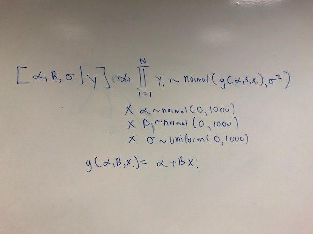

```{r, echo = FALSE}
library(knitr)
```

## Background

- Give a **quick** overview of your awesome project.
- One slide only for this!

## DAG

- Take a picture of your awesome DAG and put it here using the code below.
- Save the image as png and you fiddle with the `out.width` percent below as needed.

```{r, out.width = "60%", fig.align = 'center', echo = FALSE}
include_graphics("DAG.png")
```

## Joint Distribution

- Take a picture of your awesome joint distribution and put it here using the code below.

```{r, out.width = "70%", fig.align = 'center', echo = FALSE}

```

## Joint Distribution

- Alternatively, you can use latex to typset your joint distribution. Here is an example for a simple linear regression:

\begin{align*}
[\alpha, \beta, \sigma \mid y] & =  \prod_{i=1}^{N} \text{normal}(y_{i} \mid g(\alpha, \beta, x_{i}), \sigma^{2})\\
& \times \text{normal}(\alpha \mid 0, 1000) \times \text{normal}(\beta \mid 0, 1000)\\
& \times \text{uniform}(\sigma \mid 0, 100)\\
g(\alpha, \beta, x_{i}) & =  \alpha + \beta x_{i}
\end{align*}


